<!--
SPDX-FileCopyrightText: 2023 - 2024 Ali Sajid Imami

SPDX-License-Identifier: Apache-2.0
SPDX-License-Identifier: MIT
-->

# EBNF Grammar

## Introduction

This chapter serves to provide an annotated [Extended Backus-Naur Form (EBNF)](https://en.wikipedia.org/wiki/Extended_Backus%E2%80%93Naur_form) grammar for the language. The grammar is not intended to be a formal specification of the language, but rather a tool for understanding the language's syntax.

The EBNF syntax allows us to express the grammar in a concise and readable way. The grammar is annotated with comments that explain the meaning of each rule. The grammar is also annotated with the precedence and associativity of each operator.

## EBNF Crash Course

EBNF is a notation for describing the syntax of a language. It is a formal grammar that is used to describe the syntax of many programming languages, including the language of this book.

Briefly, an EBNF grammar consists of a series of rules. The rules can be "terminal" or "non-terminal". A terminal rule is a rule that is defined in terms of a literal string. A non-terminal rule is a rule that is defined in terms of other rules.

## BF Grammar

The BF Grammar will be split into two sections:

1. The terminal symbols: This will enumerate all the symbols and what they mean.
2. The the non-terminal constructs: These would be the constructs, made up of the terminal symbols that will actually appear in the program.

### Terminal Symbols

The following rules map the operations to the terminal text symbols:

#### Increment

The `increment` operation is represented by the `+` symbol. This operation increments the value at the current cell by one.

```ebnf
increment = "+";
```

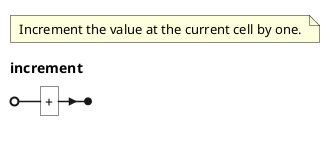

#### Decrement

The `decrement` operation is represented by the `-` symbol. This operation decrements the value at the current cell by one.

```ebnf
decrement = "-";
```

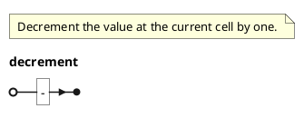

#### Move Right

The `move_right` operation is represented by the `>` symbol. This operation moves the pointer to the right by one cell. This operation translates into incrementing the memory pointer by one. If this operation is performed when the pointer is at the last cell, then the pointer will wrap around to the first cell.

```ebnf
move_right = ">";
```

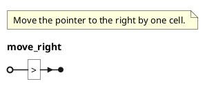

#### Move Left

The `move_left` operation is represented by the `<` symbol. This operation moves the pointer to the left by one cell. This operation translates into decrementing the memory pointer by one. If this operation is performed when the pointer is at the first cell, then the pointer will wrap around to the last cell.

```ebnf
move_left = "<";
```

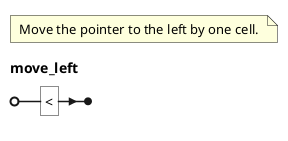

#### Output

The `output` operation is represented by the `.` symbol. This operation outputs the value at the current cell as a character. This operation translates into printing the value at the current cell as a character to whichever output stream is being used. The value printed will be the ASCII representation of the value at the current cell.

```ebnf
output = ".";
```

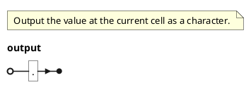

#### Input

The `input` operation is represented by the `,` symbol. This operation reads a character from input and stores it in the current cell. This operation translates into reading a character from whichever input stream is being used and storing it in the current cell. The value stored in the cell will be the ASCII value of the character.

```ebnf
input = ",";
```

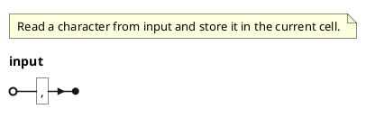

#### Loop Start

The `loop_start` operation is represented by the `\[` symbol. This operation marks the start of a loop. The nearest `loop_end` instruction will refer to this. This operation translates into marking the current instruction as the start of a loop.

```ebnf
loop_start = "[";
```

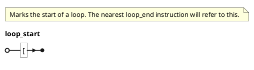

#### Loop End

The `loop_end` operation is represented by the `]` symbol. This operation marks the end of a loop. The nearest `loop_start` instruction will refer to this. This operation checks the value in the current cell. If the value is not zero, then the instruction pointer will jump back to the matching `loop_start` instruction. If the value is zero, then the instruction pointer will continue to the next instruction. This operation translates into marking the current instruction as the end of a loop.

```ebnf
loop_end = "]";
```

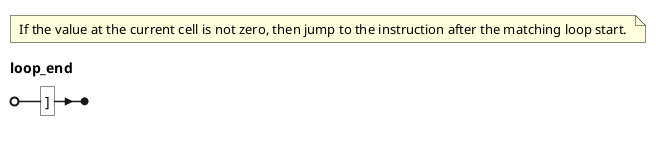

### Non-Terminal Constructs

The following rules define the non-terminal constructs that will appear in the program:

#### Loop

A loop is a set of zero or more instructions delimited by a `loop_start` and a `loop_end`. The instructions in the loop will be executed repeatedly until the value at the current cell is zero.

```ebnf
loop = loop_start, statement*, loop_end;
```

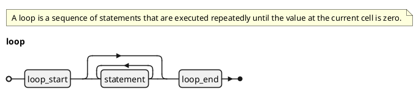


#### Statement

A statement can be one of two things:

1. A single instruction that can be executed. This would be one of the following:
    - `increment`
    - `decrement`
    - `move_right`
    - `move_left`
    - `output`
    - `input`
2. A `loop`. This would be the same as [the loop construct](#loop).

```ebnf
statement = increment | decrement | move_right | move_left | output | input | loop;
```

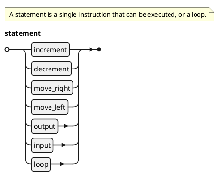

#### Program

The program is a series of zero or more statements. This is the top-level construct that will appear in the program.

```ebnf
program = statement*;
```

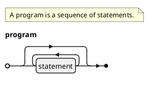


## Complete Grammar


### EBNF Specification

The complete grammar is shown below:

```ebnf
(* Increment the value at the current cell by one. *)
increment = "+";

(* Decrement the value at the current cell by one. *)
decrement = "-";

(* Move the pointer to the right by one cell. *)
move_right = ">";

(* Move the pointer to the left by one cell. *)
move_left = "<";

(* Output the value at the current cell as a character. *)
output = ".";

(* Read a character from input and store it in the current cell. *)
input = ",";

(* Marks the start of a loop. The nearest loop_end instruction will refer to this. *)
loop_start = "[";

(* If the value at the current cell is not zero, then jump to the instruction after the matching loop start. *)
loop_end = "]";

(* A loop is a sequence of statements that are executed repeatedly until the value at the current cell is zero. *)
loop = loop_start, {statement}, loop_end;

(* A statement is a single instruction that can be executed, or a loop.*)
statement = increment | decrement | move_right | move_left | output | input | loop;

(* A program is a sequence of statements. *)
program = {statement};
```

### Railroad Diagram

A railroad diagram is a graphical representation of a grammar. The following railroad diagram was generated from the EBNF grammar above:

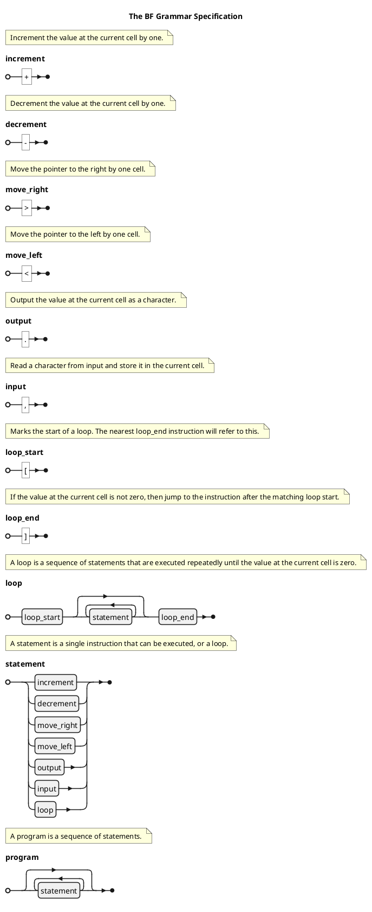
