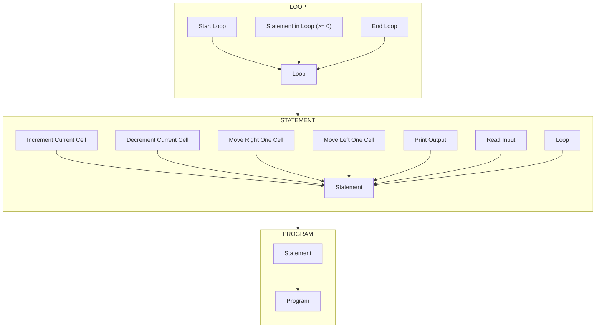

# Brainfoamkit Language Specification

## Introduction

Brainfoamkit is an interpreter and visualizer for understanding the brainfuck programming language. For this purpose, it is important to document the state of the programming language and the standard that we are implementing. This set of files documents the language specification we will be implementing.

## Language References

This document adapts from the following sources:

| Link | Description |
| ---- | ----------- |
| [The Brainfuck esolangs.org page](https://esolangs.org/wiki/Brainfuck)| Contains most of the information, including history, base specification and conventions.|
|[The Brainfuck Rosetta Code page](https://rosettacode.org/wiki/Category:Brainf***)| Provides more than a few examples that can be used to understand the expected behavior of a brainfuck program.|
|[The Brainfuck WikiPedia page](https://en.wikipedia.org/wiki/Brainfuck)| Further explanation of the language's behavior.|
|[roachhd's Guide to Brainfuck Programming](https://gist.github.com/roachhd/dce54bec8ba55fb17d3a)| An excellent and comprehensive guide on how to write Brainfuck programs. Also includes two different implementations of Brainfuck interpreters.|

## Language Specification

### Brainfuck Grammar

[grammar.ebnf](./grammar.ebnf) contains a comprehensive grammar for brainfuck in the Extended Backus-Naur Form. We can also visualize the language as a syntax diagram:

Railroad diagrams are an alternate way of representing an EBNF grammar. You can see an exhaustive railroad diagram of this grammar [here](railroad.md)

### Brainfuck Syntax

The brainfuck language contains only 8 operations that can be taken. Each of these operations is represented by a single ASCII character. The following table explains those characters and the corresponding action.

| Symbol | Effect |
| :------: | :------ |
| `+` | Increment the value in the current memory cell|
| `-` | Decrement the value in the current memory cell|
| `>` | Move the memory pointer to the right|
| `<` | Move the memory pointer to the left|
| `[` | Begin a loop: continue if value in memory cell is nonzero|
| `]` | End a loop: jump back to corresponding `[` if value in memory cell is nonzero|
| `.` | Output the ASCII value in the current memory cell|
| `,` | Read a single ASCII character and store it in the current memory cell|

### Input/Output

Brainfuck only communicates to using a terminal interface.
It has a single character output and a single character input buffer.

Input and Output is interpreted using the ASCII table.

### Memory

Brainfuck is conceptualized as a digital turing machine. Thus, the program inputs and actions take place over a tape.
The tape has a finite number of cells. Each cell is essentially a 1-byte (or 8-bit) value.

## Design Decisions

The following decisions have been made when it comes to handling conventions and practical issues:

| Issue | Options | Decision |
| ----- | ------- | -------- |
| **UTF-8 Support**| |`Brainfoamkit` will not support UTF-8. We will strictly follow the ASCII table.|
| **Tape Length**| |`Brainfoamkit` will provide only finite tape lengths. The tape lengths will be configurable and default to 30,000. However, it will not be infinite.|
| **Tape Extrema**| | `Brainfoamkit` will have a wrapping tape. Once the pointer reaches the last cell, a right move instructions will bring it back to the first cell. Similarly, A left move instruction at the first cell will take the pointer to the last cell.|
| **EOF Handling**| | `Brainfoamkit` will use the original implementation's solution of leaving the memory cell unchanged upon reaching an End-Of-File (EOF) character.|
| **Newline Handling**| | `Brainfoamkit` will use the original implementation's solution of using the ASCII value 10 for a newline character.|
