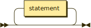
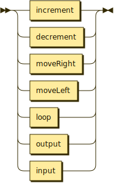
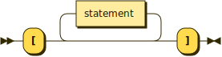

<!--
SPDX-FileCopyrightText: 2023 - 2024 Ali Sajid Imami

SPDX-License-Identifier: Apache-2.0
SPDX-License-Identifier: MIT
-->

# Railorad Diagrams

## **Program:**



```yacc
program  ::= statement*
```

## **Statement:**



```yacc
statement
         ::= increment
           | decrement
           | moveRight
           | moveLeft
           | output
           | input
           | loop
```

referenced by:

* [loop](#loop)
* [program](#program)

## **Loop:**



```yacc
loop     ::= loopStart statement* loopEnd
```

referenced by:

* [statement](#statement)

## Operators

### **Increment:**


```yacc
increment
         ::= '+'
```

referenced by:

* [statement](#statement)

### **Decrement:**


```yacc
decrement
         ::= '-'
```

referenced by:

* [statement](#statement)

### **Move Right:**


```yacc
moveRight
         ::= '>'
```

referenced by:

* [statement](#statement)

### **Move Left:**


```yacc
moveLeft ::= '<'
```

referenced by:

* [statement](#statement)

### **Output:**


```yacc
output   ::= '.'
```

referenced by:

* [statement](#statement)

### **Input:**


```yacc
input    ::= ','
```

referenced by:

* [statement](#statement)

### **Loop Start:**


```yacc
loopStart
         ::= '['
```

referenced by:

* [loop](#loop)

### **Loop End:**


```yacc
loopEnd  ::= ']'
```

referenced by:

* [loop](#loop)


## Acknowledgements

 generated by [RR - Railroad Diagram Generator][RR]

[RR]: http://bottlecaps.de/rr/ui
